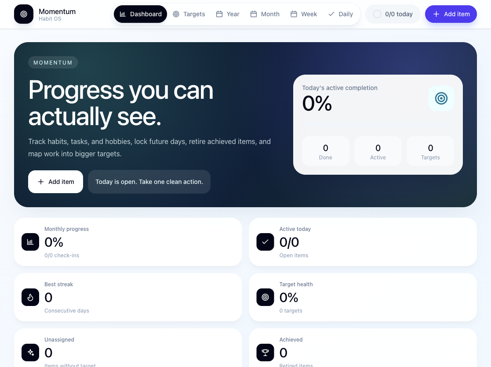

# Prabath Sai Portfolio

A polished personal portfolio for Prabath Sai, a full-stack developer and product-minded builder. The site is built to present Prabath’s work clearly to recruiters, product teams, and collaborators, with a focus on Momentum Habit Tracker as the featured project.

## Live Demo

- Portfolio: https://www.prabath.in
- Featured project: https://momentum.prabath.in

## Tech Stack

- Vue 3
- Vite
- Vue Router
- Three.js
- Plain CSS with custom design tokens
- GitHub Pages deployment from `docs/`

## Featured Project

### Momentum Habit Tracker

Momentum is a focused habit and task dashboard for daily check-ins, target tracking, and progress heatmaps across week, month, and year views.

Screenshot placeholder:



## Local Setup

```bash
npm install
npm run dev
```

Build for production:

```bash
npm run build
```

Preview the production build:

```bash
npm run preview
```

## Deployment Notes

This repository uses GitHub Pages with the `docs/` folder as the published root.

After building, copy the generated `dist/` output into `docs/` while preserving the custom domain file:

```bash
npm run build
rsync -a --delete dist/ docs/
cp CNAME docs/CNAME
```

The root `CNAME` and `docs/CNAME` should both point to:

```text
www.prabath.in
```

## Repository Hygiene

- `.DS_Store` is ignored through `.gitignore`.
- The MIT license is preserved in `LICENSE`.
